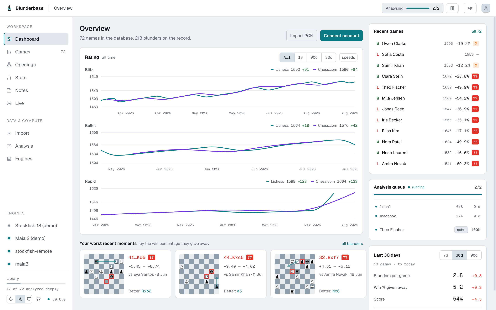

<p align="center">
  
</p>

<h1 align="center">Blunderbase</h1>

<p align="center">
  Personal chess database<br/>
</p>

---

## Features
- Import games from Lichess, Chess.com, FICS, and PGNs
- Analyze your games with multiple engines
- Support for maia3 at multiple ELO's to see what humans would have played
- Take notes on positions and variations
- Awesome Engine-Line visualizer
- Full MCP support to discuss games with an AI-Agent and a shared live board
- Local engines and stockfish wasm
- Remote-Engine-Runner to use your company's idle inference-server-CPUs for your hobbies
- Opening explorer with win-stats over your own games
- Reference explorer beside it: the Lichess masters and rated databases, with model games to play through
- White and Black opening repertoires you build on the board, with a comment on any move
- Fully self-hostable, easiest via docker

<p align="center">
  
  
  
</p>

## Roadmap
- Desktop app for Linux, Mac and Windows
- Mobile companion app for iOS and Android
- Sync-Service to keep multiple blunderbase's in sync
- Multi-Engine-Analysis on the same game, for the engine nerds
- Puzzles out of your games
- Import games of others for study and analysis 

## Tech Stack

| Layer | Tech |
|-------|------|
| Backend | Python 3.12, FastAPI, SQLAlchemy + Alembic |
| Frontend | React 19 + TypeScript + Vite, shadcn/Radix, Tailwind CSS 4 |
| Database | SQLite in WAL mode — one file, `BLUNDERBASE_DB_PATH` |
| Chess | Stockfish (any UCI engine), Maia via lc0, chessground + chessops |
| MCP | Built into the backend — stdio for local clients, streamable HTTP at `/mcp` |

## Quick Start

Prerequisites: Python 3.12+, uv, Node 22+, pnpm

```bash
make install          # uv sync + pnpm install
make run              # migrations, API + /mcp on :8765, Vite on :5273
make engines          # register this machine's Stockfish (and Maia) as local engines
```

Or as a container:

```bash
docker run -d --name blunderbase -p 8765:8765 -v blunderbase-data:/data \
  ghcr.io/philphilphil/blunderbase:latest
```

The first person to open a fresh deployment chooses the password; that password is also
an MCP bearer token, until you mint per-client keys on Assistant. The
[verified backup and restore workflow](docs/reference.md#export-backup-and-restore) safely
copies the live SQLite database, including committed WAL data.
For TLS termination and reverse-proxy examples see [docs/deploy.md](docs/deploy.md).

## Project Structure

```
backend/
  api/              — FastAPI routes, auth, SPA serving
  mcp/              — MCP server (stdio + streamable HTTP)
  services/         — the only place a "blunder" or a stat is defined
  adapters/         — Lichess, Chess.com, FICS, UCI engines, Maia
web/                — React SPA
tests/              — pytest
docs/               — deploy.md, runners.md, reference.md, ARCHITECTURE.md
```

`api/` and `mcp/` never touch the database: both are thin wrappers over `services/`,
which is what stops the browser and the coach from disagreeing. Details in
[docs/ARCHITECTURE.md](docs/ARCHITECTURE.md); auth, engines, configuration, the CLI,
releases and testing are in [docs/reference.md](docs/reference.md).

## License

[MIT](LICENSE). The image
ships Debian's Stockfish package (GPL-3.0), unmodified and separately licensed. It also
ships `@lichess-org/stockfish-web` — Stockfish compiled to WebAssembly, declared
`AGPL-3.0-or-later` by its npm package and distributed with the GNU GPL v3 as its LICENSE
file — together with the neural network it loads. Both are unmodified and separately
licensed too, and both are served as their own files in the web output rather than bundled
into any JavaScript of ours.
