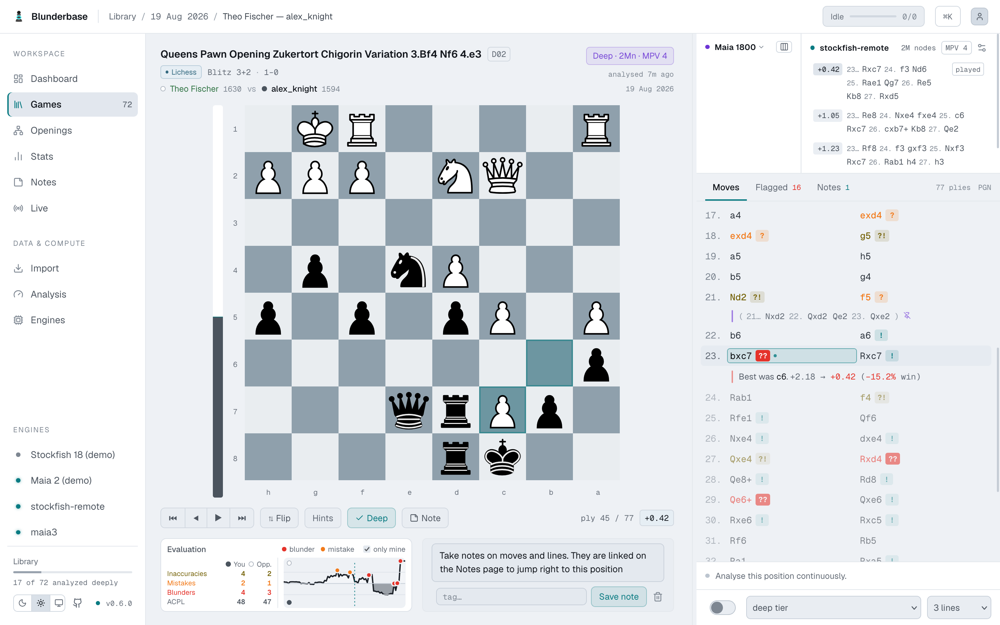
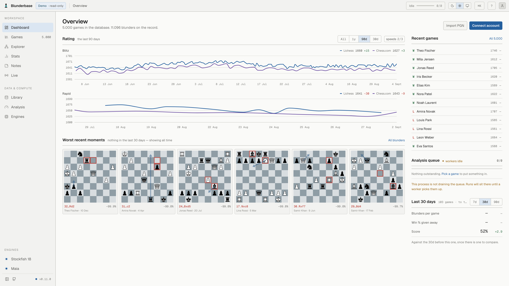
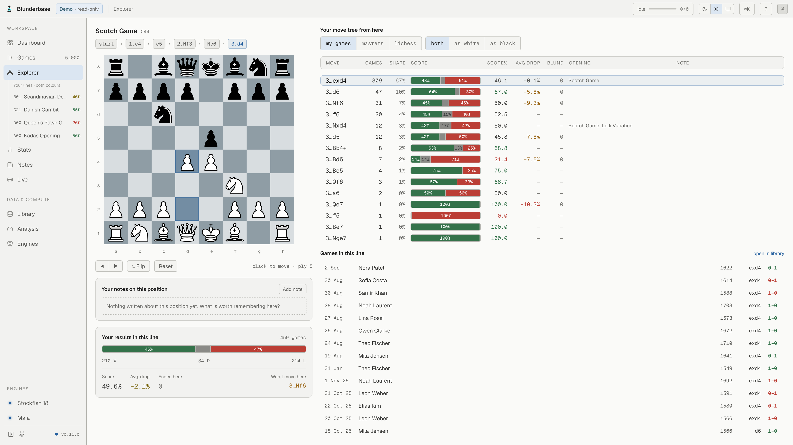
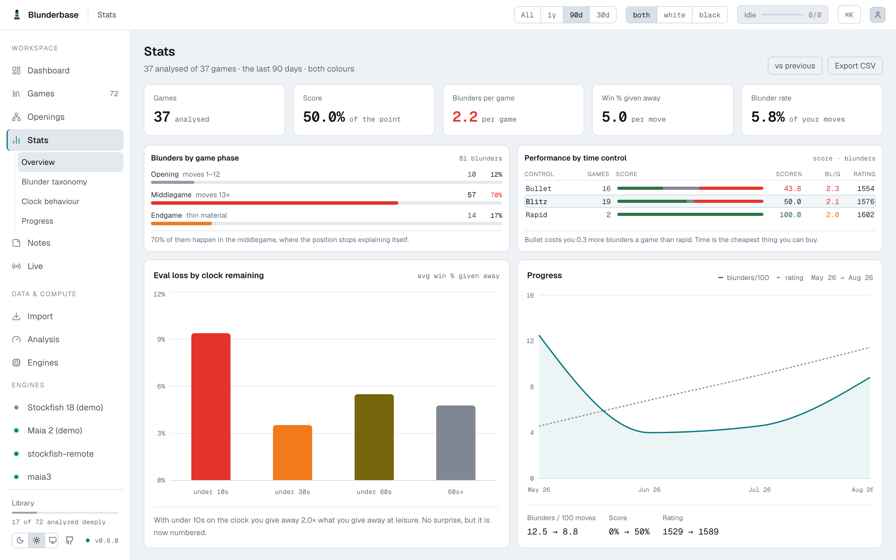

<p align="center">
  
</p>

<h1 align="center">Blunderbase</h1>

<p align="center">
  Personal chess database<br/>
</p>

<p align="center">
  <a href="https://blunderbase.org">blunderbase.org</a> ·
  <a href="https://blunderbase.org/manual/">manual</a> ·
  <a href="https://demo.blunderbase.org">try the demo</a>
</p>

---

## Features
- Import games from Lichess, Chess.com, FICS, and PGNs
- Analyze your games with multiple engines
- Support for maia3 at multiple ELO's to see what humans would have played
- Take notes on positions and variations
- Awesome Engine-Line visualizer
- Full MCP support to discuss games with an AI-Agent and a shared live board
- Local engines and stockfish wasm
- Remote-Engine-Runner to use your company's idle inference-server-CPUs for your hobbies
- Game explorer with win-stats over your own games and connected lichess db with 8 billion games
- Add reference games to your library for analysis and notes
- Fully self-hostable, easiest via docker

<p align="center">
  <picture>
    <source media="(prefers-color-scheme: dark)" srcset="docs/screenshots/game-dark.png">
    
  </picture>
  <picture>
    <source media="(prefers-color-scheme: dark)" srcset="docs/screenshots/dashboard-dark.png">
    
  </picture>
  <picture>
    <source media="(prefers-color-scheme: dark)" srcset="docs/screenshots/explorer-dark.png">
    
  </picture>
  <picture>
    <source media="(prefers-color-scheme: dark)" srcset="docs/screenshots/stats-dark.png">
    
  </picture>
</p>

## Quick Start

```bash
docker run -d --name blunderbase -p 8765:8765 -v blunderbase-data:/data \
  ghcr.io/philphilphil/blunderbase:latest
```

Open <http://localhost:8765>, choose a password, connect an account. There are desktop
installers on the [releases page](https://github.com/philphilphil/blunderbase/releases)
too.

## Documentation

Everything else — importing, analysis, the explorer, the coach, engines, remote runners,
reverse proxies, configuration, the CLI, backup and restore — is in the manual:

**[blunderbase.org/manual](https://blunderbase.org/manual/)** ·
[auf Deutsch](https://blunderbase.org/manual/de/)

Your own installation serves the same manual at `/manual/`, so it matches the version you
are running. How the code is built is in [docs/ARCHITECTURE.md](docs/ARCHITECTURE.md) and
[docs/contributing.md](docs/contributing.md).

## Roadmap
- Desktop app for Linux, Mac and Windows
- Mobile companion app for iOS and Android
- Sync-Service to keep multiple blunderbase's in sync
- Multi-Engine-Analysis on the same game, for the engine nerds
- Puzzles out of your games
- Import games of others for study and analysis

## Tech Stack

- **Backend** Python 3.12, FastAPI, SQLAlchemy + Alembic, SQLite in WAL mode — one file.
- **Frontend** React 19 + TypeScript + Vite, shadcn/Radix, Tailwind CSS 4, chessground.
- **Chess and MCP** Stockfish (any UCI engine) and Maia via lc0; MCP is built into the
  backend, stdio for local clients and streamable HTTP at `/mcp`.

## License

[AGPL-3.0-or-later](LICENSE), copyright Phil Baum. Releases up to and including v0.9.0
were published under MIT and stay that way; everything after is AGPL. The image ships
Debian's Stockfish package (GPL-3.0), unmodified and separately licensed. It also ships
`@lichess-org/stockfish-web` — Stockfish compiled to WebAssembly, declared
`AGPL-3.0-or-later` by its npm package and distributed with the GNU GPL v3 as its LICENSE
file — together with the neural network it loads. Both are unmodified and separately
licensed too, and both are served as their own files in the web output rather than bundled
into any JavaScript of ours.
